# Gentoo Linux

## Goal

This document will walk you through installing [Gentoo Linux](https://en.wikipedia.org/wiki/Gentoo_Linux)
on top of a [Snapper](http://snapper.io/) ready [__BTRFS__](https://en.wikipedia.org/wiki/Btrfs) file system
that resides inside a [Logical Vulume Manager](https://en.wikipedia.org/wiki/Logical_Volume_Manager_(Linux)) (__LVM__) Logical Volume (__LV__) inside a Volume Group (__VG__) 
inside a encrypted [Linux Unified Key Setup](https://en.wikipedia.org/wiki/Linux_Unified_Key_Setup) (__LUKS__) partition

## Target System

In this example our target system is a [QEMU](https://en.wikipedia.org/wiki/QEMU)/[KVM](https://en.wikipedia.org/wiki/Kernel-based_Virtual_Machine) [Virtual Machine](https://en.wikipedia.org/wiki/Virtual_machine) running 
- CPU x86-64-v3, 8 Cores 16 Threads 
- Ram 16 GB
- Drive 200GB
- booted via [Unified Extensible Firmware Interface](https://en.wikipedia.org/wiki/UEFI) (UEFI)
- System Language EN/DE

You have to adjust accordingly for your own needs.
Please utilize the official [Gentoo Documentation](https://wiki.gentoo.org/wiki/Handbook:AMD64/en)


## Preparation

We use an Official Gentoo Linux [mirror](https://en.wikipedia.org/wiki/Mirror_site) throughout this installation.
Please find one near you via [Gentoo Source Mirrors](https://www.gentoo.org/downloads/mirrors/)

```
#Name               Protocol    IPv4/v6	    URL
#Ionos SE (1&1)     https       IPv4 + IPv6 https://eu.mirror.ionos.com//linux/distributions/gentoo/gentoo/
#Ionos SE (1&1)     rsync       IPv4 + IPv6 rsync://eu.mirror.ionos.com/gentoo/
```

the current Gentoo [LiveGUI USB Image](https://www-cdn.gentoo.org/downloads/amd64/) is our installation envirnoment.

Please adjust the following URL accordingly as the one in this guide is current as of writing.
```
https://eu.mirror.ionos.com//linux/distributions/gentoo/gentoo/releases/amd64/autobuilds/current-livegui-amd64/livegui-amd64-20260510T170106Z.iso
```
Now it's time to boot our machine/VM from the installation envirnoment.

After the system is booted we start with the actual Installation.

## Installation

### What to install?

Bootsrapping Gentoo is a bit different than other Linux Distributions in so far as it uses a multitude of [Stage Files](https://wiki.gentoo.org/wiki/Stage_file) instead of a single small
base system tarball.

We make use of the current stage-3 desktop openrc stage file.

Please adjust this URL according to your needs and the latest stage file.

Note: In the context of Gentoo linux __"current"__ refferencs the rolling release and __"stable"__ the milestone release.

In this guide we will follow __current__.

```
https://eu.mirror.ionos.com/linux/distributions/gentoo/gentoo/releases/amd64/autobuilds/current-stage3-amd64-desktop-openrc/stage3-amd64-desktop-openrc-20260614T170130Z.tar.xz
```

### Prepare the Installation Envirnoment

As long as we are in our Installation Envirnoment we will use the [__sudo__](https://en.wikipedia.org/wiki/Sudo) command to execute tasks with superuser (root) privileges.

However within the chroot and our newly installed system we will use [__doas__](https://en.wikipedia.org/wiki/Doas).

__sudo -i__ ≈ __doas -s__

#### Open the __Console__ by starting [__Konsole__](https://en.wikipedia.org/wiki/Konsole)

#### Set root password and create our install user
```
sudo -i
passwd
useradd -m -G users,wheel uwe
psswd uwe
su - uwe
```
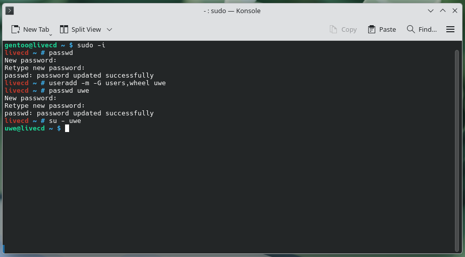
#### (optional) start sshd
This step can be skipped if the installation is done locally
```
sudo rc-service sshd start
```
#### (optional) get the IP Address of our Install Environment
```
ip a
```
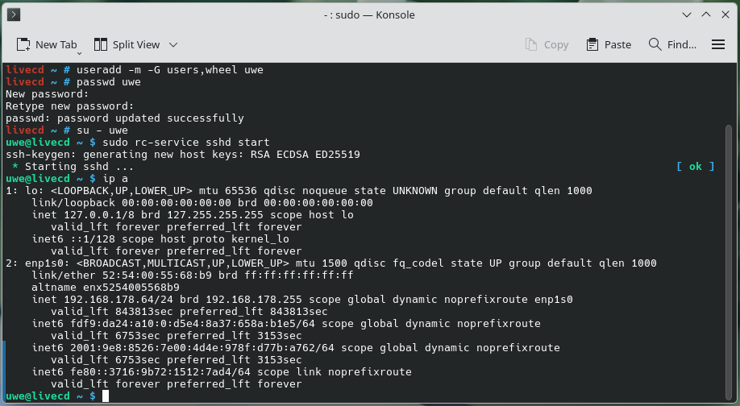

At this point you can either continue the installation locally or ssh into the Installation Environment and continue from remote 

All the following steps need to be performed with superuser (root) privileges

```
sudo -i
```
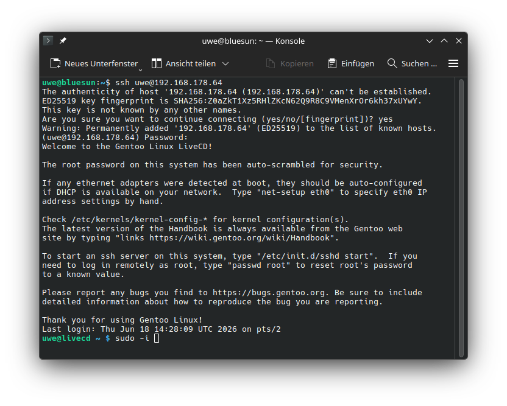

### prepare Installation target

our target device is called __/dev/vda__ because it's a [virtio](https://wiki.osdev.org/Virtio) [block device](https://en.wikipedia.org/wiki/Device_file#Block_devices) other valid targets are
```
/dev/vd?
/dev/sd?
/dev/nvme?n?
/dev/mmcblk?
```
Note: replace ? with the number/letter that specifies your target device

#### sanitze the target device

##### Wipe the device
Remove all Filesystem, RAID and Partition Table signatures from target device
```
wipefs -a /dev/vda
```

##### (optional) secure erase the target drive

For NVME SSDs perform ```nvme sanitize /dev/nvme0 -a 0x02``` and for all other block devices perform ```blkdiscard -vfz /dev/vda```.

Note: This operation can take a long time depending on size and speed of the target drive.

For more on secure wipe consult the [Gentoo Handbook](https://wiki.gentoo.org/wiki/Secure_wipe)

#### Partitioning the target device

##### Check that the target is in deed empty
```
parted /dev/vda print
```
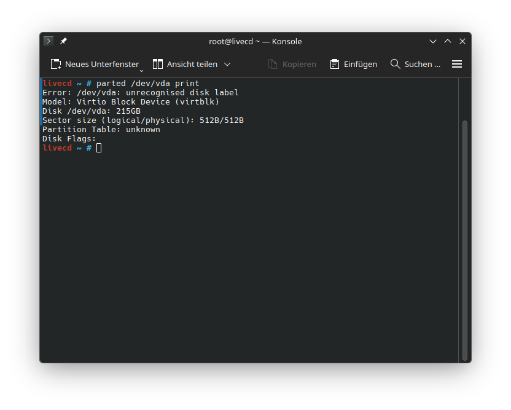

##### Create the Partion Table and Partitions
```
parted /dev/vda mklabel gpt
parted /dev/vda mkpart primary fat32 0% 2.5GB
parted /dev/vda name 1 esp
parted /dev/vda set 1 esp on
parted /dev/vda set 1 boot on
parted /dev/vda mkpart primary 2.5GB 100%
parted /dev/vda name 2 LUKS-crypt
```

##### Check that the target is correctly partitioned
```
parted /dev/vda print
```
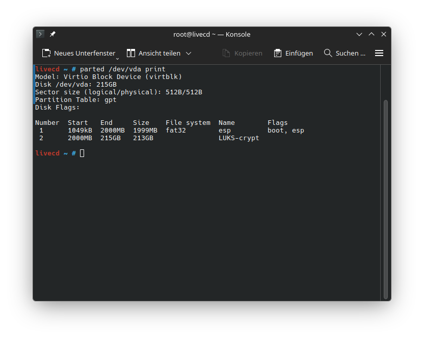

#### EFI File system creation
```
mkfs.fat -F 32 -n EFI /dev/vda1
```

#### LUKS Partition creation
```
cryptsetup luksFormat /dev/vda2
```
unlock the LUKS Container and map it to __/dev/mapper/crypt__
```
cryptsetup luksOpen /dev/vda2 crypt
```
(optional) enable discards on __LUKS__

SSD/SD/mmc block devices should enable discards
```
cryptsetup refresh --persistent --allow-discards crypt
```
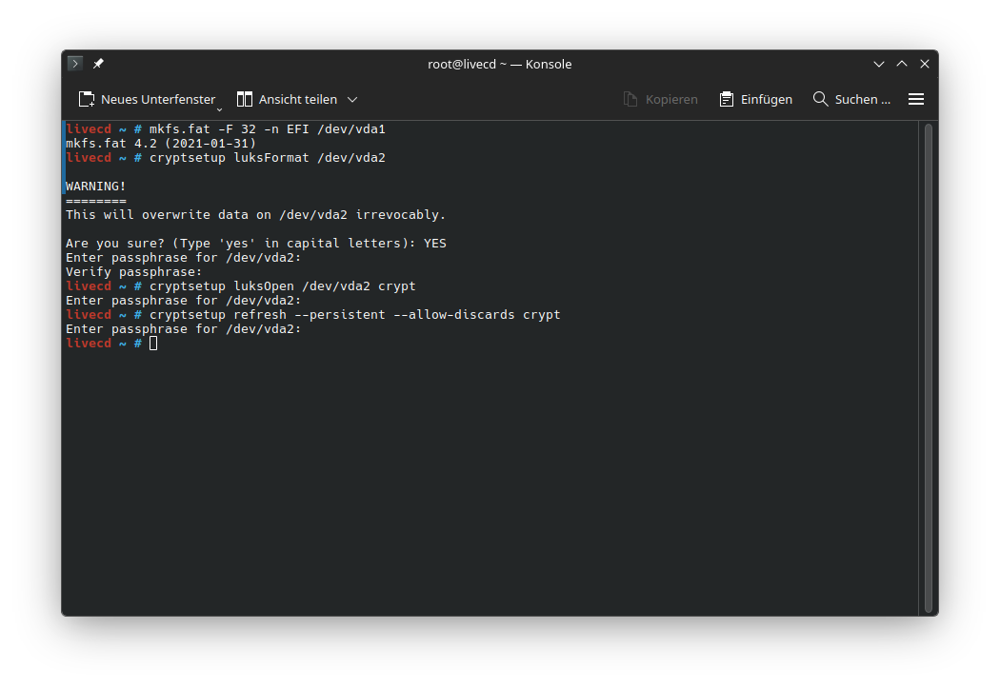

#### LVM configuration

Create a Physical Volume (__PV__) mapped to  our __LUKS__ Container and a Volume Group (__VG__) named __system__ 
Note: the Physical Volume (__PV__) creation on LUKS container is implicit.
```
vgcreate system /dev/mapper/crypt
```
We create two Logical Volums (__LV__) in our Volume Group (__VG__) __system__. 

The first __LV__ contains our swap. We name it __swap__.

A good size for it is RAM Size * 2.5
```
lvcreate --name swap -L 40G system
```
The Second __LV__ contains our __BTRFS__ File System. We name it __root__. 
```
lvcreate --name root -l 100%free system
```
The __LVs__ are mapped into the system as ```/dev/{VG}/{LV}``` and ```/dev/mapper/{VG}-{LV}```
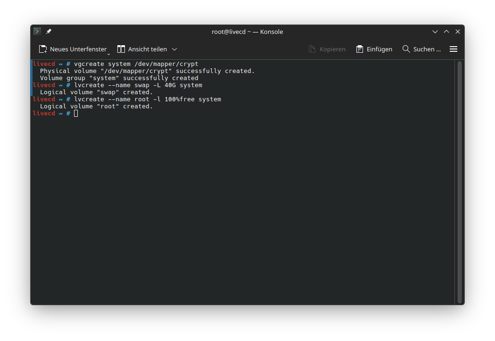

#### Filesystem Creation

Create swap on /dev/system/swap and name it __swapfs__
```
mkswap /dev/system/swap -L swapfs
```
Enable swap
```
swapon /dev/system/swap
```
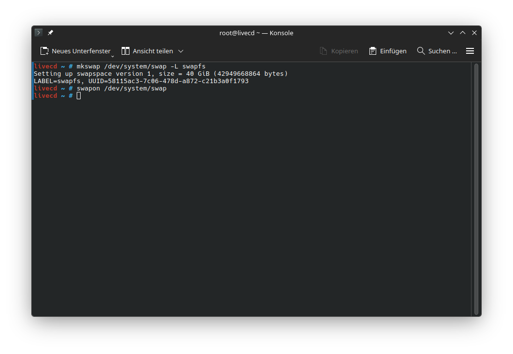

Create BTRFS on /dev/mapper/system-root and name it __rootfs__
```
mkfs.btrfs -f -L rootfs /dev/mapper/system-root
```
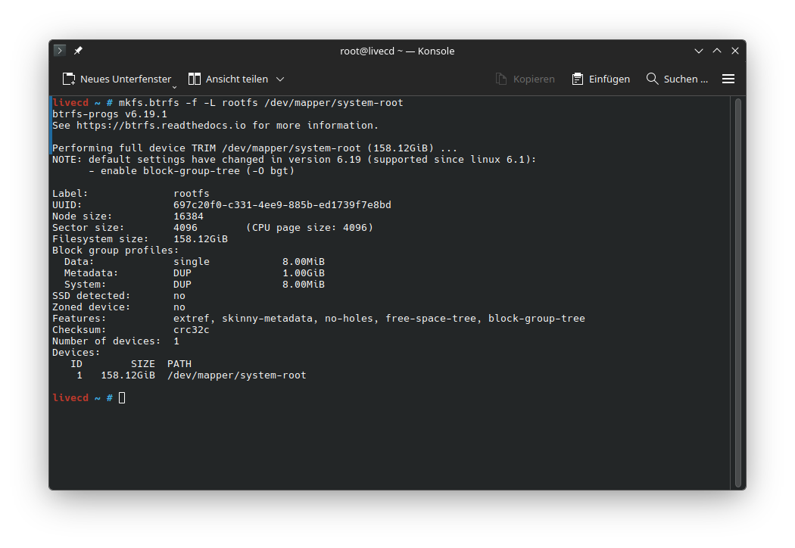

Create the BTRFS Subvolums
```
mount -v -t btrfs -o ssd,compress=zstd:11,subvol=/ /dev/system/root /mnt/gentoo
btrfs subvolume create /mnt/gentoo/@
btrfs subvolume create /mnt/gentoo/@home
btrfs subvolume create /mnt/gentoo/@root
btrfs subvolume create /mnt/gentoo/@var@log
btrfs subvolume create /mnt/gentoo/@snapshots
btrfs subvolume create /mnt/gentoo/@home/.snapshots
```
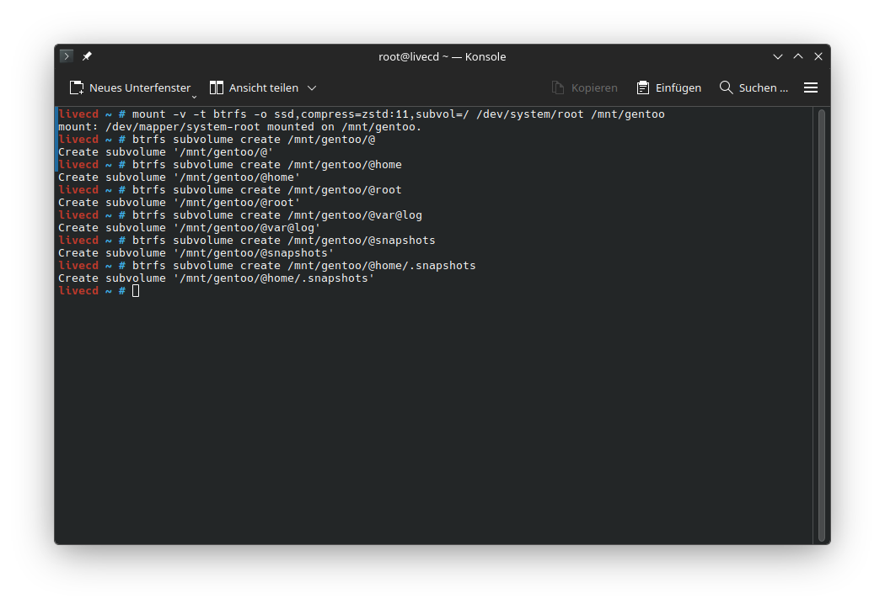

check if all is done correctly
```
btrfs subvolume list /mnt/gentoo
```
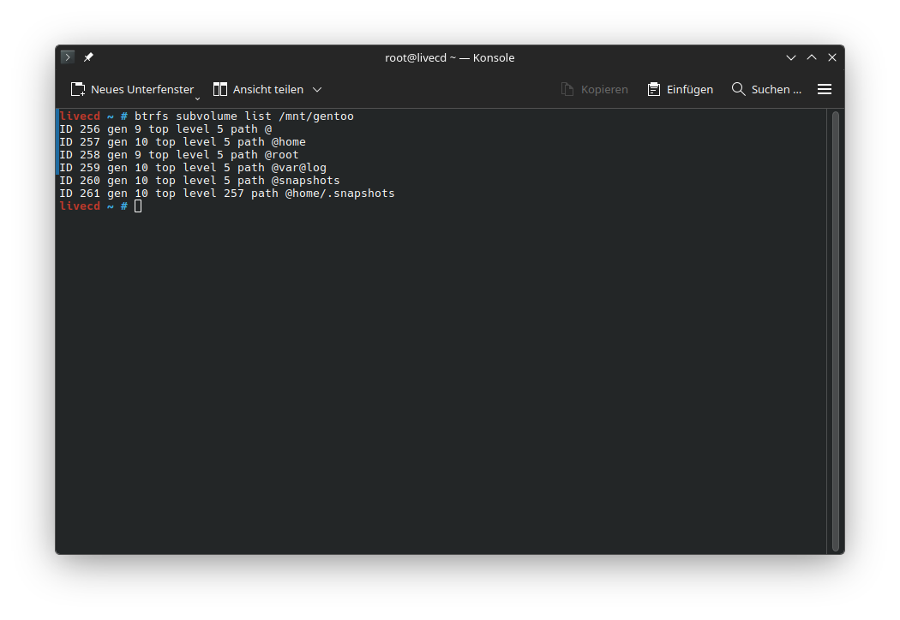

Set __@__ as the __default__ subvolume
```
btrfs subvolume set-default /mnt/gentoo/@
```
check if it's set correctly
```
btrfs subvolume get-default /mnt/gentoo
```
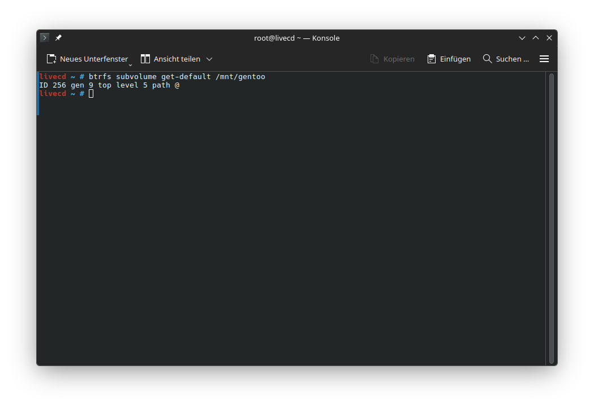
cleanup
```
umount /mnt/gentoo
```
#### Mount Filesystems for use in the chroot Environment
```
mount -t btrfs -o compress=zstd:11,ssd,noatime,subvol=/@ /dev/system/root /mnt/gentoo
chmod 755 /mnt/gentoo
mount -m -t btrfs -o compress=zstd:11,ssd,noatime,subvol=/@root /dev/system/root /mnt/gentoo/root
mount -m -t btrfs -o compress=zstd:11,ssd,noatime,subvol=/@var@log /dev/system/root /mnt/gentoo/var/log
mount -m -t btrfs -o compress=zstd:11,ssd,noatime,subvol=/@snapshots /dev/system/root /mnt/gentoo/.snapshots
mount -m -t btrfs -o compress=zstd:11,ssd,noatime,subvol=/@home /dev/system/root /mnt/gentoo/home
mount -m -t vfat /dev/vda1 /mnt/gentoo/boot
```
check if everything is mounted in the right place
```
findmnt -R /mnt/gentoo
```
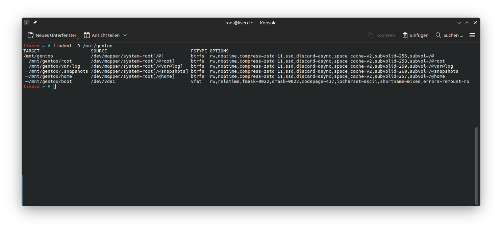

### Bootstrap Gentoo Linux

Consult the [Gentoo Handbook](https://wiki.gentoo.org/wiki/Handbook:AMD64/Installation/Stage) for vaildation steps and in depth explanations.

Reminder: Make sure you use the correct URL for your chosen mirror and stage file.
```
cd /mnt/gentoo
curl -O https://eu.mirror.ionos.com/linux/distributions/gentoo/gentoo/releases/amd64/autobuilds/current-stage3-amd64-desktop-openrc/stage3-amd64-desktop-openrc-20260614T170130Z.tar.xz
tar xpf stage3-*.tar.xz --xattrs-include='*.*' --numeric-owner -C /mnt/gentoo
```
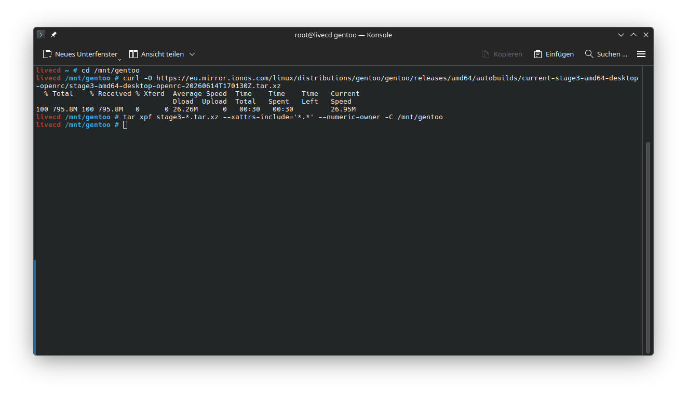

### Copy DNS setting from the Install Environment to the chroot

```
cp --dereference /etc/resolv.conf /mnt/gentoo/etc/
```

### Put a sane __make.conf__ in place
This __/etc/portage/make.conf__ file is set up for
a 8 Cores 16 Threads x86-64-3 system with 32 GB of RAM
Note: Don't forget to set __Gentoo_Mirrors=__ to your local mirror

```
cat <<'EOF' >  /etc/portage/make.conf
# Please consult /usr/share/portage/config/make.conf.example for a more
# detailed example.
COMMON_FLAGS="-march=x86-64-v3 -O2 -pipe"
CFLAGS="${COMMON_FLAGS}"
CXXFLAGS="${COMMON_FLAGS}"
FCFLAGS="${COMMON_FLAGS}"
FFLAGS="${COMMON_FLAGS}"
RUSTFLAGS="${RUSTFLAGS} -C target-cpu=x86-64-v3"
#conf for 8c/16t with 32 GB RAM
MAKEOPTS="-j8 -l17"

# NOTE: This stage was built with the bindist USE flag enabled

# This sets the language of build output to English.
# Please keep this setting intact when reporting bugs.
LC_MESSAGES=C.UTF-8

GENTOO_MIRRORS="https://eu.mirror.ionos.com/linux/distributions/gentoo/gentoo/"

EOF
```

### chroot into the new Gentoo Installation

```
sudo arch-chroot /mnt/gentoo
source /etc/profile
export PS1="(chroot) ${PS1}"
```
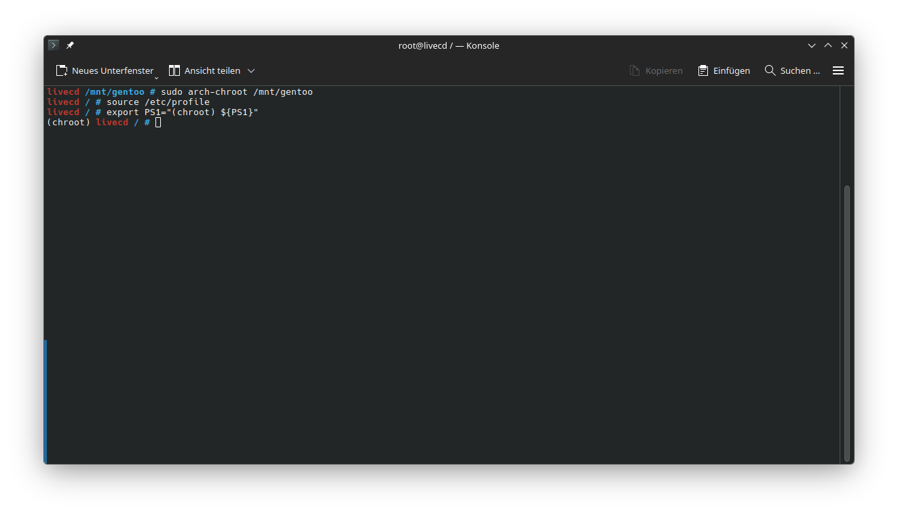

Consult the [Gentoo Handbook](https://wiki.gentoo.org/wiki/Handbook:AMD64/Installation/Base) about Installing the Gentoo base system

#### Check mounts

```
lsblk -o NAME,FSTYPE,UUID,PARTUUID,RO,RM,SIZE,STATE,OWNER,GROUP,MODE,TYPE,MOUNTPOINT,LABEL,MODEL
findmnt -R /
```
Note: UUIDs device names and size can differ.
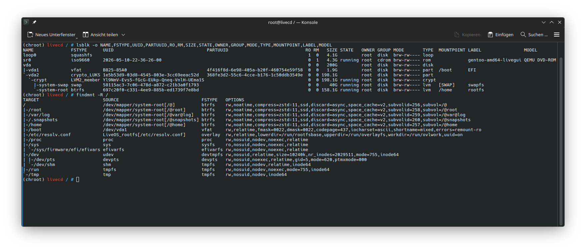


#### Sync up Gentoo Linux
```
emerge-webrsync
```
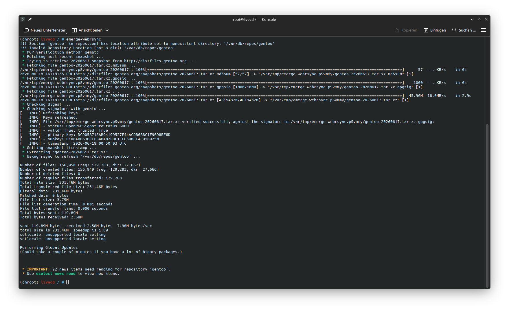

Important: ```emerge-webrsync``` overwrites ```/etc/portage/make.conf``` as of the time this document was written.
Make sure to rerun [Put a sane __make.conf__ in place](#put-a-sane-makeconf-in-place)

#### Configure Repositories

##### Configure the rsync mirror
```
mkdir /etc/portage/repos.conf
cat /usr/share/portage/config/repos.conf | sed 's|rsync://rsync.gentoo.org/gentoo-portage|rsync://eu.mirror.ionos.com/gentoo-portage|g' > /etc/portage/repos.conf/gentoo.conf
```
##### Configure the binary package host mirror

```
mkdir -p /etc/portage/binrepos.conf
cat << 'EOF' > /etc/portage/binrepos.conf/gentoo.conf
[gentoo]
priority = 9959
# NOTE: Must adjust <arch> and <variant> as appropriate!
# sync-uri = https://distfiles.gentoo.org/releases/<arch>/binpackages/<variant>
# x86-64 example sync-uri
sync-uri = https://eu.mirror.ionos.com//linux/distributions/gentoo/gentoo/releases/amd64/binpackages/23.0/x86-64/

# Introduced in portage-3.0.74 for per-repo verification choices
verify-signature = true
# Default value with >=portage-3.0.77
location = /var/cache/binhost/gentoo

[gentoo-x86-64-v3]
priority = 9999
sync-uri = https://eu.mirror.ionos.com//linux/distributions/gentoo/gentoo/releases/amd64/binpackages/23.0/x86-64-v3/
# Introduced in portage-3.0.74 for per-repo verification choices
verify-signature = true
# Default value with >=portage-3.0.77
location = /var/cache/binhost/gentoo-x86-64-v3
EOF
```
##### Configure portage to use binary packages

```
cat <<EOF >> /etc/portage/make.conf
# Appending getbinpkg to the list of values within the EMERGE_DEFAULT_OPTS variable
EMERGE_DEFAULT_OPTS="${EMERGE_DEFAULT_OPTS} --getbinpkg"
BINPKG_FORMAT="gpkg"
USE="${USE} bindist"
EOF
```
Generate the package signing keyring
```
getuto
```

##### Sync up Gentoo Linux
```
emerge --sync
```

##### Set the System Profile

Set the default/linux/amd64/23.0/desktop/plasma (stable) Profile

```
eselect profile list
eselect profile set 7
```
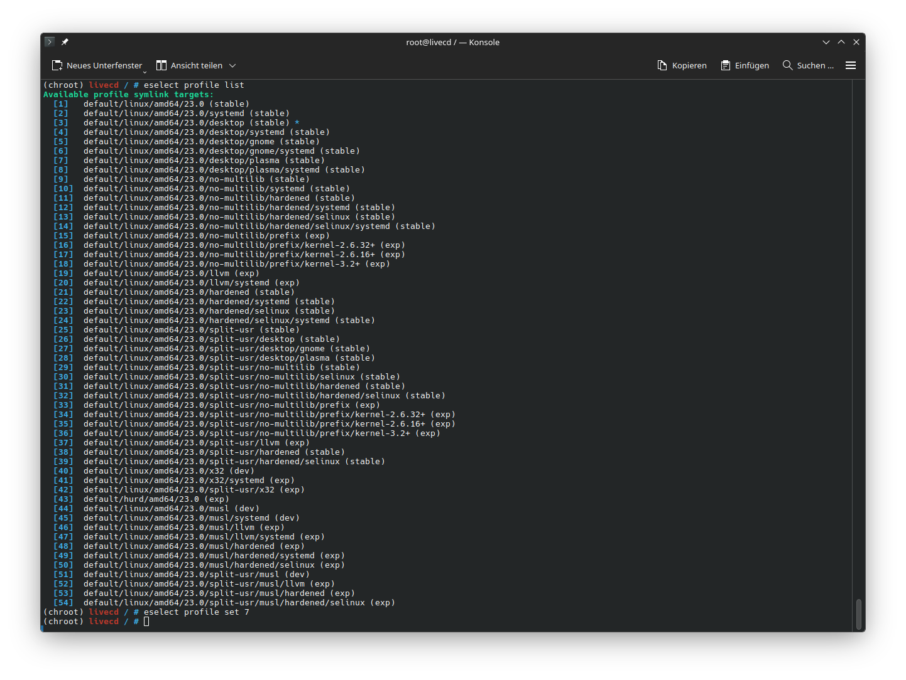

```
#we don't do that to not mess with binhost packages
#emerge --ask --oneshot app-portage/cpuid2cpuflags
#echo "*/* $(cpuid2cpuflags)" > /etc/portage/package.use/00cpu-flags
```

##### Set the GPU

The most commonly used GPUs are
- virgl, QEMU/KVM virtio GPU 
- d3d12, WSL2 virtual Windows GPU
- amdgpu radeonsi, AMD GPUs
- intel, iGPUs/dGPUs
- nouveau, NVidia GPUs (free) 
- nvidia, NVidia GPUs (proprietary)

```
echo "*/* VIDEO_CARDS: -* virgl" > /etc/portage/package.use/00video_cards
```

##### Set the acceptable licences
```
echo 'ACCEPT_LICENSE="-* @FREE @BINARY-REDISTRIBUTABLE"' >> /etc/portage/make.conf
```

##### Set use flags

```
echo 'USE="${USE} elogind -systemd wayland kde"' >> /etc/portage/make.conf
```

##### Updating the __@world__ set
```
emerge --ask --verbose --update --deep --newuse --getbinpkg @world
```

##### emerge news
Portage may output informational messages similar to the following:

```
* IMPORTANT: 22 news items need reading for repository 'gentoo'.
* Use eselect news to read news items.
```

News items were created to provide a communication medium to push critical messages to users via the Gentoo ebuild repository. 
To manage them, use ```eselect news```.
The eselect application is a Gentoo-specific utility that allows for a common management interface for system administration.
In this case, eselect is asked to use its news module.

For the news module, three operations are most used:

- With ```eselect news list``` an overview of the available news items is displayed.
- With ```eselect news read``` the news items can be read.
- With ```eselect news purge``` news items can be removed once they have been read and will not be reread anymore.

##### Clean Up 
```
emerge --ask --pretend --depclean
emerge --ask --depclean
```
##### User Configuratiom

Set root user account password
```
passwd root
```
Create main user account and set password
```
useradd -m -G wheel,kvm,users,audio -s /bin/bash uwe
passwd uwe
```

###### Install and configure Doas

```
emerge --ask app-admin/doas
echo "permit persist :wheel" > /etc/doas.conf
chown -c root:root /etc/doas.conf
chmod -c 0400 /etc/doas.conf
```

##### Set the hostname
echo myhostname > /etc/hostname

##### Set the Timezone
The Timezone is set to CET

Adjust accordingly.
```
ln -sf ../usr/share/zoneinfo/Europe/Berlin /etc/localtime
```

##### Configure locales
The locales are set to en_US (English, USA) and de_DE (German, Germany)

Adjust accordingly.

Configure /etc/local.gen
```
cat << 'EOF' > /etc/locale.gen
en_US.UTF-8 UTF-8
de_DE.UTF-8 UTF-8
EOF
```

Generate locales
```
locale-gen
```
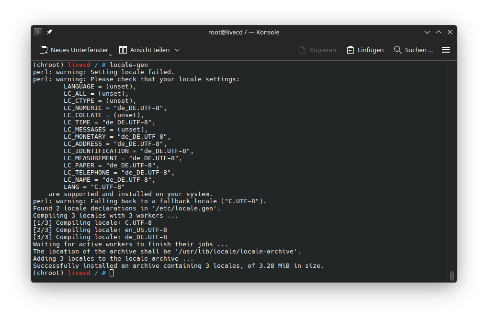

Set the system default locale
```
eselect locale list
eselect locale set 4
```

Reload session with the new local
```
env-update && source /etc/profile && export PS1="(chroot) ${PS1}"
```
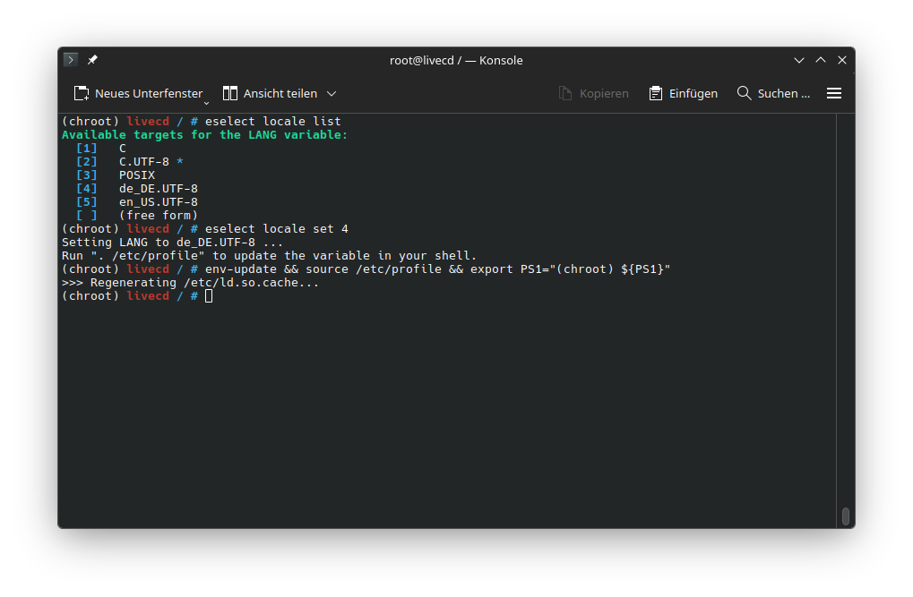

##### Configure keymaps

```
cat << 'EOF' > /etc/conf.d/keymaps
# Use keymap to specify the default console keymap.  There is a complete tree
# of keymaps in /usr/share/keymaps to choose from.
keymap="de-latin1-nodeadkeys"

# Should we first load the 'windowkeys' console keymap?  Most x86 users will
# say "yes" here.  Note that non-x86 users should leave it as "no".
# Loading this keymap will enable VT switching (like ALT+Left/Right)
# using the special windows keys on the linux console.
windowkeys="YES"

# The maps to load for extended keyboards.  Most users will leave this as is.
extended_keymaps=""
#extended_keymaps="backspace keypad euro2"

# Tell dumpkeys(1) to interpret character action codes to be
# from the specified character set.
# This only matters if you set unicode="yes" in /etc/rc.conf.
# For a list of valid sets, run `dumpkeys --help`
dumpkeys_charset=""

# Some fonts map AltGr-E to the currency symbol instead of the Euro.
# To fix this, set to "yes"
fix_euro="NO"
EOF
```

##### Generate Machine ID
```
dbus-uuidgen --ensure=/etc/machine-id
```


##### Install NetworkManager

```
echo 'USE="${USE} networkmanager"' >> /etc/portage/make.conf
emerge --ask net-misc/networkmanager
rc-update add NetworkManager default
```

##### Install syslog-ng

```
emerge --ask app-admin/syslog-ng
emerge --ask app-admin/logrotate
rc-update add syslog-ng default
```

##### Install Cron

```
emerge --ask sys-process/cronie
rc-update add cronie default
```

##### Install NTP

```
emerge --ask net-misc/chrony
rc-update add chronyd default
```

##### Enable sshd
rc-update add sshd default

##### Install File indexing
```
emerge --ask sys-apps/mlocate
```
##### Install bash completion
```
emerge --ask app-shells/bash-completion
```
##### Install gentoolkit
```
emerge --ask app-portage/gentoolkit
```
##### Install File Sytem tools

```
emerge --ask sys-fs/cryptsetup
emerge --ask sys-fs/btrfs-progs
emerge --ask sys-fs/dosfstools
emerge --ask sys-fs/xfsprogs
emerge --ask sys-fs/e2fsprogs
emerge --ask sys-fs/ntfs3g
emerge --ask sys-fs/f2fs-tools
emerge --ask sys-fs/mdadm
emerge --ask dev-python/zstandard
emerge --ask sys-block/io-scheduler-udev-rules
```

##### Install the Logical Vulume Manager

Set the USAGE flag
```
cat << 'EOF' >> /etc/portage/package.use/lvm2
#Enable support for the LVM daemon and related tools
sys-fs/lvm2 lvm
EOF
```
Install and enable LVM
```
emerge --ask sys-fs/lvm2
rc-update add lvm boot
```

##### Build /etc/fstab
```
emerge --ask sys-fs/genfstab
genfstab -U / >> /etc/fstab
```
check generated file
```
cat /etc/fstab
```
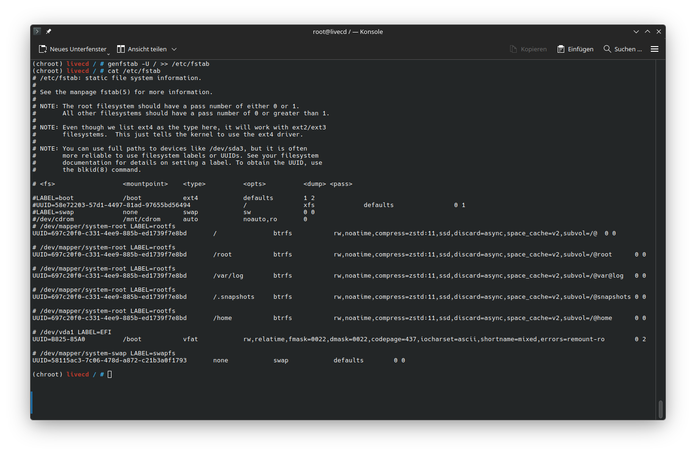

##### Build /etc/crypttab
We need the __UUID__ for the LUKS Container ```/dev/vda2```

```
```


```
echo "crypt /dev/vda2 none luks,discard" > /etc/crypttab
#better use the UUID=
echo "crypt UUID=1d643b2b-6093-4029-9add-abf842013588   none    luks,discard" > /etc/crypttab


emerge --ask sys-kernel/linux-firmware
emerge --ask sys-firmware/sof-firmware

cat << 'EOF' >> /etc/portage/package.use/installkernel
sys-kernel/installkernel -dracut ugrd grub
EOF

echo 'GRUB_PLATFORMS="efi-64"' >> /etc/portage/make.conf

mkdir -p /etc/kernel
echo "quiet splash" > /etc/kernel/cmdline
mkdir -p /etc/cmdline.d
ln -s /etc/kernel/cmdline /etc/cmdline.d/00-installkernel.conf

#make sure that external kmods get auto rebuild
echo 'USE="${USE} dist-kernel"' >> /etc/portage/make.conf

#we want to build our own kernel
emerge --ask sys-kernel/gentoo-kernel

#Just use the gentoo default kernel binary
emerge --ask sys-kernel/gentoo-kernel-bin


#Once configured, installkernel can be re-emerged and will pull UGRD
emerge -ask sys-kernel/installkernel

####Install ZFS support
emerge --ask sys-fs/zfs

#To force an initramfs rebuild, emerge --config can be used on dist-kernel packages:
emerge --config sys-kernel/gentoo-kernel
#or
emerge --config sys-kernel/gentoo-kernel-bin

emerge --ask --getbinpkg=n sys-boot/grub
grub-install --efi-directory=/boot
grub-mkconfig -o /boot/grub/grub.cfg
emerge --ask --getbinpkg=n sys-kernel/installkernel[grub]

#let's add some software
echo 'USE="${USE} elogind -systemd"' >> /etc/portage/make.conf
echo 'USE="${USE} lzma zstd curl"' >> /etc/portage/make.conf
emerge --ask --getbinpkg=n dev-vcs/git
emerge --ask --getbinpkg=n sys-process/btop
emerge --ask --getbinpkg=n app-misc/fastfetch
emerge --ask --getbinpkg=n app-misc/tmux

#KDE
emerge --ask kde-plasma/plasma-meta kde-apps/kde-apps-meta
emerge --ask gui-libs/display-manager-init

#world update
emerge --ask --verbose --update --deep --changed-use --getbinpkg=n @world
rc-update add elogind boot
emerge --ask x11-misc/sddm
usermod -a -G video sddm
echo "sys-auth/seatd server" > /etc/portage/package.use/seatd
emerge --oneshot sys-auth/seatd
rc-update add seatd default
rc-service seatd start
usermod -aG seat sddm
usermod -aG seat uwe

cat << 'EOF' > /etc/conf.d/display-manager
CHECKVT=7
DISPLAYMANAGER="sddm"
EOF

#do some cleanup
eclean-dist
eclean-pkg
rm /stage3-*.tar.*

#we're done with the chroot
exit
rc-service elogind start
rc-update add display-manager default
rc-service display-manager start
emerge --ask kde-plasma/sddm-kcm

cat << 'EOF' > /etc/sddm.conf
[Users]
MaximumUid=60000
MinimumUid=1000
EOF
#reboot time
sudo reboot

Note: because someone asked about the VM config, here you go
---
```
```
<domain type="kvm">
  <name>Gentoo2</name>
  <uuid>d33ee995-4d99-4763-a888-e4f0166dc495</uuid>
  <metadata>
    <libosinfo:libosinfo xmlns:libosinfo="http://libosinfo.org/xmlns/libvirt/domain/1.0">
      <libosinfo:os id="http://almalinux.org/almalinux/10"/>
    </libosinfo:libosinfo>
  </metadata>
  <memory unit="KiB">33554432</memory>
  <currentMemory unit="KiB">16777216</currentMemory>
  <memoryBacking>
    <source type="memfd"/>
    <access mode="shared"/>
  </memoryBacking>
  <vcpu placement="static">16</vcpu>
  <os firmware="efi">
    <type arch="x86_64" machine="pc-q35-10.0">hvm</type>
    <firmware>
      <feature enabled="no" name="enrolled-keys"/>
      <feature enabled="no" name="secure-boot"/>
    </firmware>
    <loader readonly="yes" type="pflash" format="raw">/usr/share/OVMF/OVMF_CODE_4M.fd</loader>
    <nvram template="/usr/share/OVMF/OVMF_VARS_4M.fd" templateFormat="raw" format="raw">/var/lib/libvirt/qemu/nvram/Gentoo2_VARS.fd</nvram>
    <bootmenu enable="yes"/>
  </os>
  <features>
    <acpi/>
    <apic/>
    <vmport state="off"/>
  </features>
  <cpu mode="host-passthrough" check="none" migratable="on"/>
  <clock offset="utc">
    <timer name="rtc" tickpolicy="catchup"/>
    <timer name="pit" tickpolicy="delay"/>
    <timer name="hpet" present="no"/>
  </clock>
  <on_poweroff>destroy</on_poweroff>
  <on_reboot>restart</on_reboot>
  <on_crash>destroy</on_crash>
  <pm>
    <suspend-to-mem enabled="no"/>
    <suspend-to-disk enabled="no"/>
  </pm>
  <devices>
    <emulator>/usr/bin/qemu-system-x86_64</emulator>
    <disk type="file" device="cdrom">
      <driver name="qemu" type="raw"/>
      <source file="/srv/mergerfs/pool1/data/Workspace/ISOs/livegui-amd64-20260510T170106Z.iso"/>
      <target dev="sda" bus="sata"/>
      <readonly/>
      <boot order="1"/>
      <address type="drive" controller="0" bus="0" target="0" unit="0"/>
    </disk>
    <disk type="block" device="disk">
      <driver name="qemu" type="raw" cache="directsync" io="native" discard="unmap"/>
      <source dev="/dev/VMs/gentoo_delme"/>
      <target dev="vda" bus="virtio"/>
      <boot order="2"/>
      <address type="pci" domain="0x0000" bus="0x07" slot="0x00" function="0x0"/>
    </disk>
    <controller type="usb" index="0" model="qemu-xhci" ports="15">
      <address type="pci" domain="0x0000" bus="0x02" slot="0x00" function="0x0"/>
    </controller>
    <controller type="pci" index="0" model="pcie-root"/>
    <controller type="pci" index="1" model="pcie-root-port">
      <model name="pcie-root-port"/>
      <target chassis="1" port="0x10"/>
      <address type="pci" domain="0x0000" bus="0x00" slot="0x02" function="0x0" multifunction="on"/>
    </controller>
    <controller type="pci" index="2" model="pcie-root-port">
      <model name="pcie-root-port"/>
      <target chassis="2" port="0x11"/>
      <address type="pci" domain="0x0000" bus="0x00" slot="0x02" function="0x1"/>
    </controller>
    <controller type="pci" index="3" model="pcie-root-port">
      <model name="pcie-root-port"/>
      <target chassis="3" port="0x12"/>
      <address type="pci" domain="0x0000" bus="0x00" slot="0x02" function="0x2"/>
    </controller>
    <controller type="pci" index="4" model="pcie-root-port">
      <model name="pcie-root-port"/>
      <target chassis="4" port="0x13"/>
      <address type="pci" domain="0x0000" bus="0x00" slot="0x02" function="0x3"/>
    </controller>
    <controller type="pci" index="5" model="pcie-root-port">
      <model name="pcie-root-port"/>
      <target chassis="5" port="0x14"/>
      <address type="pci" domain="0x0000" bus="0x00" slot="0x02" function="0x4"/>
    </controller>
    <controller type="pci" index="6" model="pcie-root-port">
      <model name="pcie-root-port"/>
      <target chassis="6" port="0x15"/>
      <address type="pci" domain="0x0000" bus="0x00" slot="0x02" function="0x5"/>
    </controller>
    <controller type="pci" index="7" model="pcie-root-port">
      <model name="pcie-root-port"/>
      <target chassis="7" port="0x16"/>
      <address type="pci" domain="0x0000" bus="0x00" slot="0x02" function="0x6"/>
    </controller>
    <controller type="pci" index="8" model="pcie-root-port">
      <model name="pcie-root-port"/>
      <target chassis="8" port="0x17"/>
      <address type="pci" domain="0x0000" bus="0x00" slot="0x02" function="0x7"/>
    </controller>
    <controller type="pci" index="9" model="pcie-root-port">
      <model name="pcie-root-port"/>
      <target chassis="9" port="0x18"/>
      <address type="pci" domain="0x0000" bus="0x00" slot="0x03" function="0x0" multifunction="on"/>
    </controller>
    <controller type="pci" index="10" model="pcie-root-port">
      <model name="pcie-root-port"/>
      <target chassis="10" port="0x19"/>
      <address type="pci" domain="0x0000" bus="0x00" slot="0x03" function="0x1"/>
    </controller>
    <controller type="pci" index="11" model="pcie-root-port">
      <model name="pcie-root-port"/>
      <target chassis="11" port="0x1a"/>
      <address type="pci" domain="0x0000" bus="0x00" slot="0x03" function="0x2"/>
    </controller>
    <controller type="pci" index="12" model="pcie-root-port">
      <model name="pcie-root-port"/>
      <target chassis="12" port="0x1b"/>
      <address type="pci" domain="0x0000" bus="0x00" slot="0x03" function="0x3"/>
    </controller>
    <controller type="pci" index="13" model="pcie-root-port">
      <model name="pcie-root-port"/>
      <target chassis="13" port="0x1c"/>
      <address type="pci" domain="0x0000" bus="0x00" slot="0x03" function="0x4"/>
    </controller>
    <controller type="pci" index="14" model="pcie-root-port">
      <model name="pcie-root-port"/>
      <target chassis="14" port="0x1d"/>
      <address type="pci" domain="0x0000" bus="0x00" slot="0x03" function="0x5"/>
    </controller>
    <controller type="sata" index="0">
      <address type="pci" domain="0x0000" bus="0x00" slot="0x1f" function="0x2"/>
    </controller>
    <controller type="virtio-serial" index="0">
      <address type="pci" domain="0x0000" bus="0x03" slot="0x00" function="0x0"/>
    </controller>
    <controller type="scsi" index="0" model="virtio-scsi">
      <address type="pci" domain="0x0000" bus="0x04" slot="0x00" function="0x0"/>
    </controller>
    <interface type="network">
      <mac address="52:54:00:55:68:b9"/>
      <source network="bridged-network"/>
      <model type="virtio"/>
      <address type="pci" domain="0x0000" bus="0x01" slot="0x00" function="0x0"/>
    </interface>
    <serial type="pty">
      <target type="isa-serial" port="0">
        <model name="isa-serial"/>
      </target>
    </serial>
    <console type="pty">
      <target type="serial" port="0"/>
    </console>
    <channel type="unix">
      <target type="virtio" name="org.qemu.guest_agent.0"/>
      <address type="virtio-serial" controller="0" bus="0" port="1"/>
    </channel>
    <channel type="spicevmc">
      <target type="virtio" name="com.redhat.spice.0"/>
      <address type="virtio-serial" controller="0" bus="0" port="2"/>
    </channel>
    <input type="tablet" bus="usb">
      <address type="usb" bus="0" port="1"/>
    </input>
    <input type="mouse" bus="ps2"/>
    <input type="keyboard" bus="ps2"/>
    <tpm model="tpm-crb">
      <backend type="emulator" version="2.0"/>
    </tpm>
    <graphics type="spice" autoport="yes">
      <listen type="address"/>
    </graphics>
    <sound model="ich9">
      <address type="pci" domain="0x0000" bus="0x00" slot="0x1b" function="0x0"/>
    </sound>
    <audio id="1" type="spice"/>
    <video>
      <model type="virtio" heads="1" primary="yes"/>
      <address type="pci" domain="0x0000" bus="0x00" slot="0x01" function="0x0"/>
    </video>
    <redirdev bus="usb" type="spicevmc">
      <address type="usb" bus="0" port="2"/>
    </redirdev>
    <redirdev bus="usb" type="spicevmc">
      <address type="usb" bus="0" port="3"/>
    </redirdev>
    <watchdog model="itco" action="reset"/>
    <memballoon model="virtio">
      <address type="pci" domain="0x0000" bus="0x05" slot="0x00" function="0x0"/>
    </memballoon>
    <rng model="virtio">
      <backend model="random">/dev/urandom</backend>
      <address type="pci" domain="0x0000" bus="0x06" slot="0x00" function="0x0"/>
    </rng>
  </devices>
</domain>
```
```
---
```
